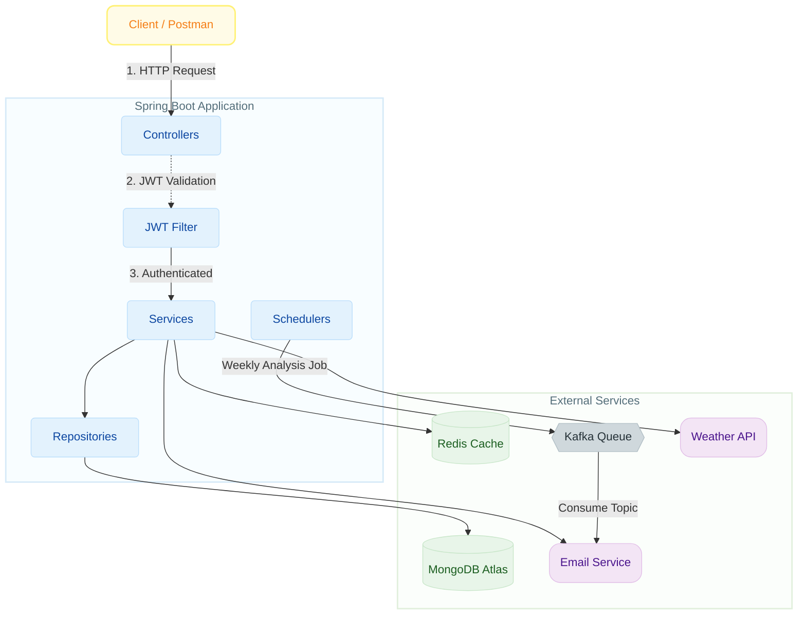

# MindScribe: A Secure Journaling API

**MindScribe** is a robust and secure backend service for a journaling application, built with Java and Spring Boot. It provides RESTful APIs for user management, journal entry CRUD operations, sentiment analysis, and weather integration, all secured with JWT-based authentication.

## 💭 Why I Built This

MindScribe helps understand core backend fundamentals including JWT authentication, role-based access control, MongoDB and Redis integration, and real-world API integrations for weather and email services.

## 🌐 Live Demo

**Live API:** [https://mind-scribe.onrender.com](https://mind-scribe.onrender.com/journal/public/health-check)

**Postman Collection:**
- 🌐 [View & Test Online](https://www.postman.com/krishnabansal-3302015/workspace/mindscribe-api/collection/46915332-eecaae3d-933f-467a-b8e4-f07aa2dba95c)
- 📥 [Download Collection](./MindScribe_Postman_Collection.json)

> **Note:** The app is hosted on Render's free tier and may take 30-60 seconds to wake up after periods of inactivity. Test the health check endpoint first!

## ✨ Features

- **JWT Authentication**: Secure token-based authentication with configurable expiration
- **User Management**: Registration, login, profile updates, and account deletion
- **Journal Entry CRUD**: Full create, read, update, and delete operations for journal entries
- **Sentiment Analysis**: Weekly email summaries based on user's most frequent sentiment
- **Weather Integration**: Real-time weather data in user greetings
- **Redis Caching**: Performance optimization through weather data caching
- **Kafka Messaging**: Asynchronous sentiment email delivery via Kafka (optional)
- **Health Monitoring**: Endpoint to check MongoDB and Redis connectivity
- **Input Validation**: Jakarta validation for all user inputs
- **Scheduled Tasks**: Automated weekly sentiment analysis and cache refresh
- **Docker Support**: Containerized deployment with multi-stage Dockerfile
- **Production Ready**: Deployed on Render with MongoDB Atlas

## 🏗️ Architecture



**Key Components:**
- **Controllers**: Handle HTTP requests and responses
- **JWT Filter**: Validates authentication tokens for protected routes
- **Services**: Business logic layer with external API integrations
- **Repositories**: Data access layer for MongoDB operations
- **Schedulers**: Background tasks for sentiment analysis and cache management
- **Redis**: Caches weather data to reduce API calls
- **Kafka**: Asynchronous message queue for email delivery (optional)

## 🛠️ Technologies Used

- **Backend Framework**: Spring Boot 3.4.7, Java 17
- **Security**: Spring Security with JWT (JSON Web Tokens)
- **Database**: MongoDB with Spring Data MongoDB
- **Caching**: Redis
- **Messaging**: Apache Kafka
- **Email**: SendGrid API, Spring Mail (JavaMailSender)
- **Build Tool**: Apache Maven
- **Testing**: JUnit 5, Mockito
- **Code Quality**: SonarQube, Lombok, SLF4J Logging
- **Configuration**: Spring Dotenv (Environment variable management)
- **Containerization**: Docker
- **Deployment**: Render (Platform as a Service)
- **Authentication**: Custom UserDetailsService with BCrypt password encoding
- **CI/CD**: GitHub Actions

## 🚀 Getting Started

### Prerequisites

- **Java JDK 17** or later
- **Apache Maven** 3.6+
- **MongoDB** (running instance or MongoDB Atlas)
- **SendGrid API Key** from [SendGrid](https://sendgrid.com/) for email functionality
- **Weather API Key** from [WeatherStack](https://weatherstack.com/) or similar
- **Redis** (optional, for caching)
- **Apache Kafka** (optional, for sentiment emails)

### Installation & Setup

1.  **Clone the repository:**
    ```sh
    git clone https://github.com/LoopMaster99/MindScribe.git
    cd MindScribe
    ```

2.  **Configure the application:**
    
    Refer to `src/main/resources/application-dev.yml` for configuration examples.
    Create your own `application.yml` with the required values.

3.  **Build the project:**
    ```sh
    mvn clean install
    ```

4.  **Run the application:**
    ```sh
    mvn spring-boot:run
    ```
    
    The application will start on `http://localhost:8080/journal`

## 🧪 API Testing with Postman

### Quick Start:

1. **Import the collection:**
   - [View Online](https://www.postman.com/krishnabansal-3302015/workspace/mindscribe-api/collection/46915332-eecaae3d-933f-467a-b8e4-f07aa2dba95c) or
   - Import `MindScribe_Postman_Collection.json` from this repository

2. **Test the live API:**
   - Collection is pre-configured with: `https://mind-scribe.onrender.com/journal`
   - First request may take 30-60 seconds (cold start)

3. **Testing workflow:**
   ```
   1. Run "Health Check" → Wakes up the app
   2. Run "User Signup" → Create your account
   3. Run "User Login" → JWT token auto-saved!
   4. Test journal CRUD operations
   ```

### Collection Features:
- ✅ **Automatic JWT token management** - Login saves token automatically
- ✅ **Automatic entry ID saving** - Create entry saves ID for update/delete
- ✅ **Pre-configured endpoints** - All 15+ endpoints ready to test
- ✅ **Detailed documentation** - Each endpoint has description and examples

## 📄 API Endpoints

> **Base URL (Local):** `http://localhost:8080/journal`  
> **Base URL (Live):** `https://mind-scribe.onrender.com/journal`

### Public Routes (No Authentication Required)

| Method | Endpoint              | Description                                    |
|:-------|:----------------------|:-----------------------------------------------|
| `GET`  | `/public/health-check`| Simple health check - returns "Ok"             |
| `POST` | `/public/signup`      | Register a new user                            |
| `POST` | `/public/login`       | Login and receive JWT token                    |

### User Routes (Authentication Required)

| Method   | Endpoint | Description                                           |
|:---------|:---------|:------------------------------------------------------|
| `GET`    | `/user`  | Get greeting with current weather for user's location |
| `PUT`    | `/user`  | Update authenticated user's profile                   |
| `DELETE` | `/user`  | Delete authenticated user's account                   |

### Journal Entry Routes (Authentication Required)

| Method   | Endpoint       | Description                                  |
|:---------|:---------------|:---------------------------------------------|
| `GET`    | `/`            | Get all journal entries for authenticated user |
| `POST`   | `/`            | Create a new journal entry                   |
| `GET`    | `/id/{myId}`   | Get a specific journal entry by ID           |
| `PUT`    | `/id/{id}`     | Update a specific journal entry by ID        |
| `DELETE` | `/id/{myId}`   | Delete a specific journal entry by ID        |

### Admin Routes (Admin Role Required)

| Method | Endpoint                   | Description                          |
|:-------|:---------------------------|:-------------------------------------|
| `GET`  | `/admin/all-users`         | Retrieve list of all users           |
| `POST` | `/admin/create-admin-user` | Create a new user with admin role    |
| `POST` | `/admin/clear-app-cache`   | Clear application configuration cache |

### Health & Monitoring

| Method | Endpoint           | Description                                    |
|:-------|:-------------------|:-----------------------------------------------|
| `GET`  | `/actuator/health` | Check MongoDB and Redis connectivity status    |

## 🔐 Authentication

All authenticated endpoints require a JWT token in the Authorization header:

```
Authorization: Bearer <your-jwt-token>
```

To obtain a token:
1. Register via `/public/signup`
2. Login via `/public/login` to receive your JWT token
3. Include the token in subsequent requests


## 🚀 Deployment

### Docker Deployment

The application includes a multi-stage Dockerfile for efficient containerization:

```bash
# Build Docker image
docker build -t mindscribe .

# Run container
docker run -p 8080:8080 \
  -e JWT_SECRET=your-secret-key \
  -e SPRING_DATA_MONGODB_URI=your-mongodb-uri \
  mindscribe
```

### Render Deployment

The app is deployed on [Render](https://render.com) with the following configuration:

**Environment Variables:**
- `JWT_SECRET` - JWT signing secret (min 32 characters)
- `JWT_EXPIRATION` - Token expiration time (default: 3600000ms)
- `SPRING_DATA_MONGODB_URI` - MongoDB Atlas connection string
- `SPRING_DATA_MONGODB_DATABASE` - Database name (default: journaldb)
- `SERVER_SERVLET_CONTEXT_PATH` - Application context path (`/journal`)
- `SENDGRID_API_KEY` - SendGrid API key for email functionality
- `WEATHER_API_KEY` - WeatherStack API key (optional)
- `SPRING_REDIS_HOST` - Redis Cloud host (optional)
- `SPRING_REDIS_PORT` - Redis Cloud port (optional)
- `SPRING_REDIS_PASSWORD` - Redis Cloud password (optional)

**Deployment Steps:**
1. Connect GitHub repository to Render
2. Select **Docker** as runtime
3. Configure environment variables
4. Deploy automatically on push to `main` branch

**Live URL:** https://mind-scribe.onrender.com

> **Note:** Free tier apps sleep after 15 minutes of inactivity. First request may take 30-60 seconds to wake up.

## 🤝 Contributing

Contributions are welcome! Please feel free to submit a Pull Request.

## 📝 License

This project is open source and available under the MIT License.

---

<div align="center">

**Built with ❤️ by Krishna Bansal**

[](https://github.com/LoopMaster99)
[](https://www.linkedin.com/in/krishna-bansal-8a2323272/)

</div>
